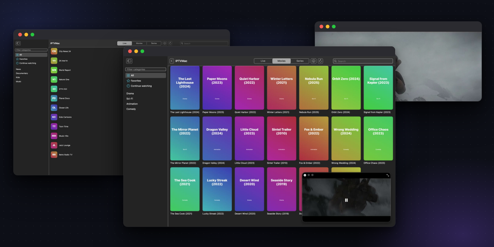

<div dir="rtl">

<div align="center">


# IPTVMac

**נגן IPTV מקורי ל-Mac.**<br>
Xtream Codes ו-M3U, חיפוש מיידי, נגן מובנה עם כתוביות, תמונה בתוך תמונה, צפייה בהיסטוריה (catch-up) והורדות.<br>
חינמי ובקוד פתוח. בלי חשבונות ובלי איסוף נתונים.

<br>

<div dir="ltr">

[](https://github.com/Goelir/IPTVMac/releases/latest)
[](https://github.com/Goelir/IPTVMac/releases)
[](LICENSE)


[](https://github.com/Goelir/IPTVMac/stargazers)

</div>

[**הורדה**](https://github.com/Goelir/IPTVMac/releases/latest) &nbsp;|&nbsp; [אתר](https://goelir.github.io/IPTVMac/he/) &nbsp;|&nbsp; [התקנה](#התקנה) &nbsp;|&nbsp; [יכולות](#יכולות) &nbsp;|&nbsp; [שאלות נפוצות](#שאלות-נפוצות) &nbsp;|&nbsp; [English](README.md)

<br>

[](https://github.com/Goelir/IPTVMac/releases/download/v0.3.4/IPTVMac-demo-he.mp4)

<sub>רשימת הדגמה עם שמות בדויים, וידאו מתוך "Sintel" של Blender Foundation (CC-BY 3.0). [סרטון הדגמה של 80 שניות](https://github.com/Goelir/IPTVMac/releases/download/v0.3.4/IPTVMac-demo-he.mp4).</sub>

</div>

## למה IPTVMac

- **מהיר.** כל הספרייה שלך נשמרת במסד נתונים מקומי עם חיפוש טקסט מלא. מציאת ערוץ מתוך 100,000 פריטים לוקחת הרבה פחות משנייה, בתוך קטגוריה, בתוך חלק, או בכל מקום.
- **יציב.** הניגון רץ על [mpv](https://mpv.io) (libmpv, מובנה). הוא מנגן סטרימים פגומים שנגנים של המערכת נכשלים בהם, מתחבר מחדש כשהסטרים נופל, ומשתמש בפענוח חומרה.
- **מקורי.** SwiftUI, בלי Electron ובלי דפדפן מובנה. אין מה להתקין בנוסף: הנגן בתוך האפליקציה.
- **פתוח.** GPL-3.0, בלי חשבונות ובלי איסוף נתונים. האפליקציה פונה רק לשרתים שהוספת, ול-GitHub לעדכונים.

## התקנה

נדרש Mac עם Apple Silicon (M1 ומעלה) ו-macOS 14 ומעלה.

**שורה אחת, בלי אזהרה של macOS.** הדביקו בטרמינל:

<div dir="ltr">

```
curl -fsSL https://raw.githubusercontent.com/Goelir/IPTVMac/main/install.sh | bash
```

</div>

השורה מורידה את הגרסה האחרונה, בודקת את החתימה ואת ה-SHA-256, מעתיקה את IPTVMac ל-`/Applications` ופותחת אותה. [install.sh](install.sh) קצר, ואפשר לקרוא אותו קודם. אחרי ההתקנה האפליקציה מתעדכנת לבד.

**או להוריד את ה-DMG.** הורידו את `IPTVMac.dmg` מ[הגרסה האחרונה](https://github.com/Goelir/IPTVMac/releases/latest), פתחו אותו וגררו את האייקון **IPTVMac** על האייקון **Applications** שבחלון (לא את קובץ ה-dmg עצמו). IPTVMac לא עברה אימות (notarization) של Apple, שדורש חשבון מפתחים בתשלום, ולכן macOS חוסמת עותק שהורד בדפדפן בהפעלה הראשונה:

- macOS 15 ומעלה: נסו לפתוח את האפליקציה פעם אחת, ואז **הגדרות המערכת > פרטיות ואבטחה**, גללו למטה ולחצו **Open Anyway** ליד IPTVMac.
- או בטרמינל: `xattr -dr com.apple.quarantine /Applications/IPTVMac.app`

רוצים לראות קודם? [סרטון התקנה של 95 שניות (באנגלית)](https://youtu.be/TgaoFEEMg48).

## הפעלה ראשונה

האפליקציה פותחת מדריך קצר בשלושה שלבים. מוסיפים רשימה מהספק:

- **Xtream Codes:** כתובת שרת (למשל `http://host:8080`), שם משתמש וסיסמה. את אלה נותן הספק שלכם.
- **M3U:** שם וקישור לרשימה.

IPTVMac היא נגן בלבד. היא לא כוללת, לא מארחת ולא מקשרת לערוצים, סרטים או סדרות: צריך מקור שמותר לכם להשתמש בו.

## צילומי מסך

<div align="center">


| | |
|:---:|:---:|
| <br>**ערוצים חיים** | <br>**חיפוש בכל מקום** |
| <br>**סדרות** | <br>**נגן** |
| <br>**תמונה בתוך תמונה** | <br>**הורדות** |

<sub>צילומי המסך משתמשים ברשימת הדגמה בדויה; הסרטון הוא הטריילר "Sintel" של Blender Foundation (CC-BY 3.0).</sub>

</div>

## יכולות

| | |
|---|---|
| **ערוצים, סרטים, סדרות** | שלושה חלקים עם קטגוריות, כרזות, לוגואים של ערוצים, "המשך צפייה" ומועדפים. |
| **חיפוש** | חיפוש בתוך הקטגוריה, בתוך החלק, או בכל מקום, והתוצאות מקובצות לפי חלק. עברית, ערבית ולטינית. |
| **נגן** | נפתח במסך מלא, והבקרים נעלמים עד שמזיזים את העכבר. רווח, חצים לדילוג (10 שניות כברירת מחדל, 5 עד 60 בהגדרות), `F` מסך מלא, `2` מהירות כפולה, `[` ו-`]` איטי ומהיר יותר, בורר מהירות מ-0.25x עד 4x (סרטים ופרקים), `A` התאמה, מילוי או מתיחה, **טיימר שינה** (אייקון ירח), שעון אופציונלי, `Esc` חזרה. |
| **כתוביות ואודיו** | רצועות מובנות, קבצי `.srt` ו-`.ass` חיצוניים (תפריט או גרירה), גודל והזזה, שפות מועדפות. |
| **תמונה בתוך תמונה** | נגן קטן צף שתמיד למעלה ועוקב אחריכם בין שולחנות עבודה, ואפשר להמשיך לגלוש. |
| **צפייה בהיסטוריה (catch-up)** | צפייה בתוכניות מהעבר בערוצים שהספק תומך בהם (Xtream `tv_archive`), לפי לוח השידורים. |
| **לוח שידורים (EPG)** | התוכנית הנוכחית והבאה ברשימת הערוצים ובנגן (Xtream). |
| **הורדות** | שמירת סרטים ופרקים (בסדרות Xtream, עונה שלמה בלחיצה) לתיקייה שבחרתם, וניגון ממסך ההורדות. |
| **רשימות** | Xtream Codes ו-M3U. עם כמה רשימות אפשר לעבור ביניהן מסרגל הכלים, או לבחור **כל הרשימות** ולחפש, לסמן מועדפים ולהמשיך לצפות מכולן, עם שם הרשימה על כל פריט. |
| **המשך ופרק הבא** | סרטים ופרקים ממשיכים מהמקום שבו עצרתם. כשפרק נגמר, הפרק הבא מתחיל אחרי ספירה לאחור של 5 שניות (אפשר לבטל או לכבות). |
| **הגדרות** | מראה (מערכת, בהיר, כהה), שפת ממשק, רענון אוטומטי של הרשימות, הסתרת קטגוריות לפי מילים, גודל מטמון הרשת, **גיבוי ושחזור** של הרשימות (בלי סיסמאות), המועדפים והיסטוריית הצפייה, וניקוי היסטוריה, מועדפים או מטמון תמונות. |
| **31 שפות** | כולל פריסה מימין לשמאל בעברית, ערבית, פרסית ואורדו. ראו [שפות](#שפות). |
| **עדכונים חתומים** | האפליקציה בודקת גרסאות חדשות, מאמתת חתימה ו-SHA-256 ומתעדכנת לבד. ראו [עדכונים](#עדכונים). |

## שאלות נפוצות

<details>
<summary><b>macOS אומרת שאי אפשר לפתוח את האפליקציה, או שהיא "פגומה".</b></summary>

האפליקציה לא עברה אימות של Apple. השתמשו בפקודת ההתקנה למעלה, או פתחו **הגדרות המערכת > פרטיות ואבטחה** ולחצו **Open Anyway**, או הריצו `xattr -dr com.apple.quarantine /Applications/IPTVMac.app`.
</details>

<details>
<summary><b>שום דבר לא מתנגן, או שאני רואה "HTTP 4xx/5xx" (למשל 403 או 413).</b></summary>

בדקו שם משתמש וסיסמה בהגדרות (**שנה סיסמה**). ספקים מסוימים עונים על סיסמה שגויה או חיבור חסום בקודי HTTP לא רגילים, כמו 403 או 413, במקום הודעה ברורה. טעות בהקלדת הסיסמה היא הסיבה הנפוצה ביותר. הנגן מציג גם את הסיבה ש-mpv מדווח עליה.
</details>

<details>
<summary><b>העדכון נכשל עם הודעה ש-GitHub מגביל בקשות, או עם "HTTP 403".</b></summary>

גרסאות שלפני 0.7.2 שאלו את ה-API של GitHub מהי הגרסה האחרונה, ו-GitHub מאפשר רק 60 בקשות כאלה בשעה לכל כתובת IP, כך שברשת משותפת אפשר להגיע למגבלה. גרסה 0.7.2 קוראת במקום זה קובץ `release.txt` חתום מ-github.com, בלי המגבלה הזו, ומודיעה בבירור כש-GitHub מגביל רשת. אם גרסה ישנה לא מצליחה להתעדכן, הורידו את `IPTVMac.dmg` מ[הגרסה האחרונה](https://github.com/Goelir/IPTVMac/releases/latest) והחליפו את האפליקציה ב-`/Applications`, או הריצו את פקודת ההתקנה למעלה. מכאן והלאה היא מתעדכנת לבד.
</details>

<details>
<summary><b>הניגון נכשל כשהורדה רצה.</b></summary>

ספקים רבים מאפשרים חיבור אחד בלבד לחשבון (`max_connections`). ההורדות רצות אחת בכל פעם; אל תצפו במשהו אחר בזמן שהורדה רצה. ריבוי חיבורים גם לא יאיץ: המהירות מוגבלת בקו של הספק.
</details>

<details>
<summary><b>למה אין מהירות כפולה בשידור חי?</b></summary>

שידור חי לא יכול לרוץ מהר מזמן אמת. שינוי מהירות עובד בסרטים, בפרקים ובצפייה בהיסטוריה.
</details>

<details>
<summary><b>Mac עם Intel או macOS ישן?</b></summary>

לא נתמך: הנגן המובנה בנוי ל-Apple Silicon (arm64) והאפליקציה דורשת macOS 14 ומעלה.
</details>

<details>
<summary><b>איפה הנתונים שלי?</b></summary>

ב-`~/Library/Application Support/IPTVMac/` (התיקייה ומסד הנתונים נגישים רק למשתמש שלכם). ראו [פרטיות](#פרטיות).
</details>

## שפות

31 שפות בממשק: עברית, אנגלית, ערבית, ספרדית, צרפתית, גרמנית, פורטוגזית, איטלקית, רוסית, אוקראינית, פולנית, רומנית, בולגרית, הולנדית, שוודית, צ'כית, הונגרית, יוונית, אלבנית, טורקית, פרסית, אורדו, הינדי, בנגלית, אינדונזית, וייטנאמית, תאית, סינית (מפושטת ומסורתית), יפנית וקוריאנית, כולל פריסה מימין לשמאל בעברית, ערבית, פרסית ואורדו. האפליקציה פועלת בשפת ה-Mac שלכם, או שבוחרים שפה בהגדרות.

חוץ מעברית, אנגלית וערבית, התרגומים נכתבו בעזרת בינה מלאכותית ועדיין לא נבדקו על ידי דוברי שפת אם. תיקונים יתקבלו בברכה.

### תרגום לשפה נוספת או תיקון תרגום

1. העתיקו את `Sources/IPTVMac/Resources/en.lproj/Localizable.strings` אל `<lang>.lproj/` (קוד שפה של Apple, למשל `pt` או `zh-Hans`) ותרגמו את הערכים. שמרו על כל מפתח ועל כל סימון מקום `%@` / `%d`, באותו סדר.
2. הוסיפו את השפה, כתובה בשפה עצמה, ל-`InterfaceLanguage.all` בקובץ `Sources/IPTVMac/AppPrefs.swift` (כך היא מופיעה בבורר השפות בהגדרות).
3. הריצו `python3 scripts/check-strings.py <lang>`. הפלט חייב להיות `OK`.

## עדכונים

האפליקציה המותקנת בודקת את GitHub Releases בהפעלה ואחת ל-6 שעות. כשיש גרסה חדשה היא מורידה אותה ומאמתת את **החתימה** של הגרסה (מפתח Ed25519 שאינו שמור ב-GitHub ומוטמע באפליקציה) ואת ה-SHA-256 שמופיע בהערות הגרסה. אחר כך מופיע באנר: **Restart to update** (או שהעדכון מותקן ביציאה הבאה). אפשר לכבות בהגדרות את הבדיקה האוטומטית ואת ההורדה האוטומטית, כל אחת לחוד.

## פרטיות

המקורות שלכם נשמרים ב-`~/Library/Application Support/IPTVMac/` (נגישים רק למשתמש שלכם). סיסמאות החשבונות נשמרות במסד הנתונים הזה כטקסט רגיל, ולא ב-Keychain (ה-Keychain ביקש הרשאה מחדש בכל גרסה). האפליקציה פונה רק לשרתים שהוספתם, ול-GitHub לבדיקת עדכונים. בלי איסוף נתונים ובלי טלמטריה.

## אבטחה

ב-[SECURITY.md](SECURITY.md) (באנגלית): איך העדכונים מוגנים, המגבלות הידועות, ואיך לדווח על פגיעות באופן פרטי.

## בנייה מקוד המקור

<div dir="ltr">

```
brew install mpv pkgconf     # mpv only supplies the C headers to compile against
scripts/swift.sh test        # tests
scripts/swift.sh run IPTVMac # run
scripts/make-dmg.sh          # builds build/IPTVMac.dmg
```

</div>

כשמותקנים רק Command Line Tools, השתמשו ב-`scripts/swift.sh` במקום ב-`swift` (הוא בוחר SDK שה-SwiftUI שלו לא צריך את תוסף המאקרו של Xcode). הערות עיצוב: [docs/superpowers/specs](docs/superpowers/specs/2026-10-05-iptvmac-design.md).

## מדריכים

אתר הפרויקט כולל מדריכים באנגלית:

- [How to watch Xtream Codes IPTV on a Mac](https://goelir.github.io/IPTVMac/guides/xtream-codes-on-mac.html)
- [How to play an M3U playlist on a Mac](https://goelir.github.io/IPTVMac/guides/m3u-playlist-on-mac.html)
- [Picture in Picture for IPTV on a Mac](https://goelir.github.io/IPTVMac/guides/picture-in-picture-iptv-mac.html)

## תרומה לפרויקט

דיווחי באגים, תרגומים ו-pull requests יתקבלו בברכה: ראו [CONTRIBUTING.md](CONTRIBUTING.md). לעולם אל תדביקו בדיווח כתובת שרת, שם משתמש או סיסמה.

## רכיבים של צד שלישי

הגרסה כוללת libmpv מוכן מראש (mpv 0.36, ffmpeg 6, בנייה תחת GPL) מ-[media-kit/libmpv-darwin-build](https://github.com/media-kit/libmpv-darwin-build) גרסה v0.7.3 (sha256 `9bb168ec908b4801f4231f411e3278a0aea644a2b03ce375c880d2813ab7f949`). `scripts/make-app.sh` מוריד ומאמת אותו; קוד המקור של הרכיבים האלה זמין בפרויקטים שמקושרים כאן. החיפוש והאחסון משתמשים ב-[GRDB.swift](https://github.com/groue/GRDB.swift) (MIT). קטעי ההדגמה: "Sintel" © Blender Foundation, [CC-BY 3.0](https://durian.blender.org).

## רישיון

[GPL-3.0](LICENSE). IPTVMac היא נגן ואינה מספקת תוכן; האחריות לשימוש במקורות מורשים בלבד היא עליכם.

</div>
