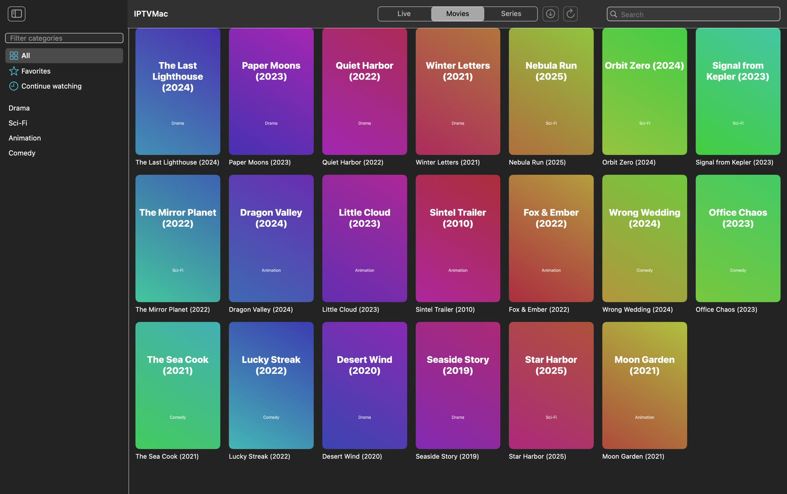
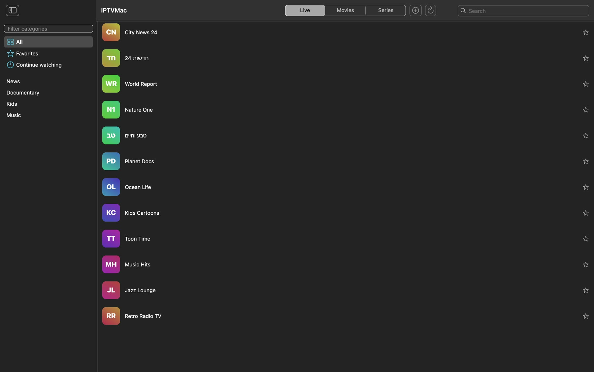
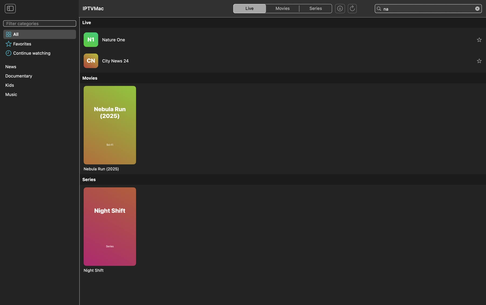
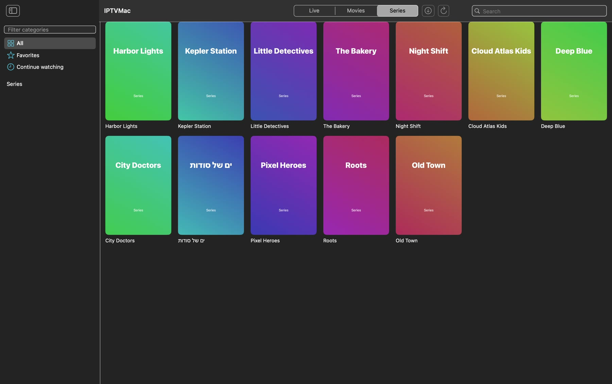
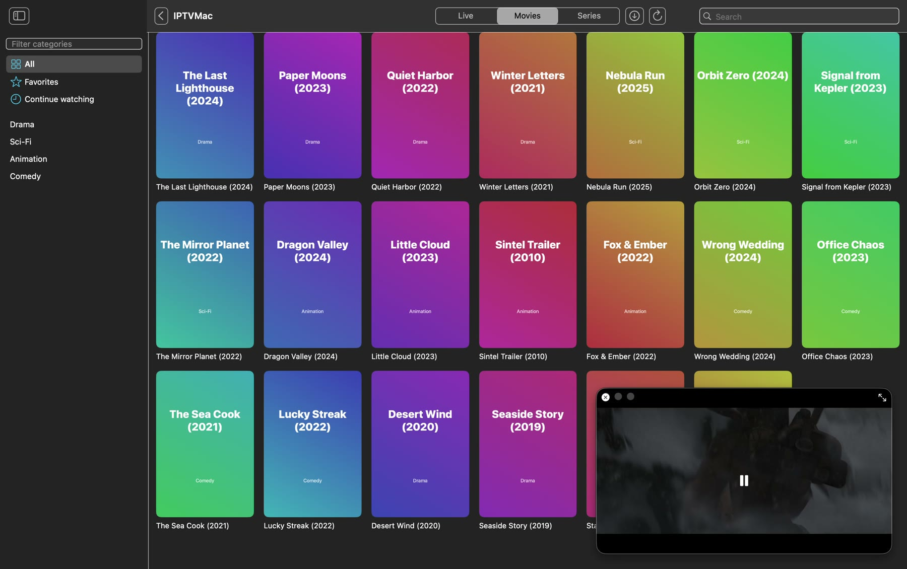
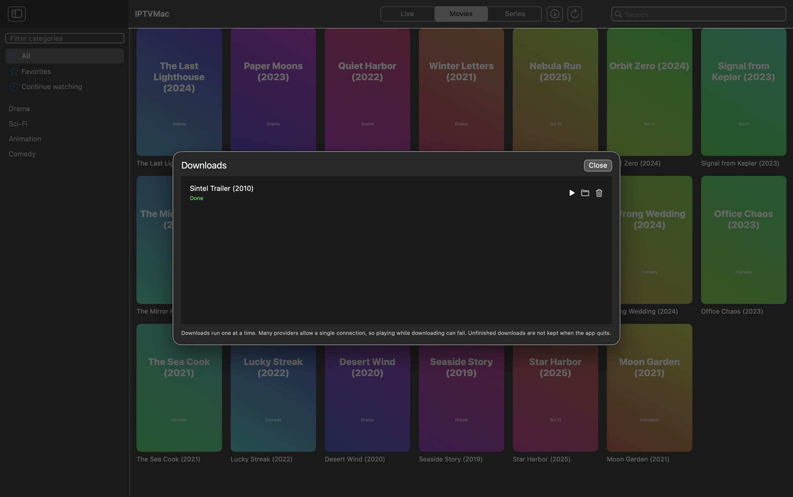

<div align="center">


# IPTVMac

**A native IPTV player for Mac.** Xtream Codes and M3U, instant search, a built-in player with subtitles, Picture in Picture, catch-up and downloads.

[](https://github.com/Goelir/IPTVMac/releases/latest)
[](https://github.com/Goelir/IPTVMac/releases)
[](LICENSE)


[**Download**](https://github.com/Goelir/IPTVMac/releases/latest) &nbsp;·&nbsp; [Website](https://goelir.github.io/IPTVMac/) &nbsp;·&nbsp; [Install](#install) &nbsp;·&nbsp; [Features](#features) &nbsp;·&nbsp; [FAQ](#faq) &nbsp;·&nbsp; [עברית](README.he.md)

<br>

[](https://github.com/Goelir/IPTVMac/releases/download/v0.3.4/IPTVMac-demo-en.mp4)

▶ [Watch the 80-second demo](https://github.com/Goelir/IPTVMac/releases/download/v0.3.4/IPTVMac-demo-en.mp4)

</div>

## Why IPTVMac

- **Fast.** Your whole library lives in a local SQLite database with full-text search: typing finds a channel among 100,000 items in well under a second, in a category, in a section, or everywhere.
- **Stable.** Playback runs on [mpv](https://mpv.io) (libmpv, bundled): it plays the broken TS and HLS streams that trip up system players, reconnects when the stream drops, and uses hardware decoding.
- **Native.** SwiftUI, no Electron, no web view. Nothing else to install: the player is inside the app.
- **Open.** GPL-3.0, no accounts, no analytics. The app talks only to the servers you add.

## Features

| | |
|---|---|
| **Live, Movies, Series** | Three sections with categories, posters, channel logos, a "Continue watching" list and favorites. |
| **Search** | Type to search inside the current category, inside the section, or everywhere (results are grouped by section). Hebrew, Arabic and Latin text. |
| **Player** | Opens full screen, controls fade out until you move the mouse. Space, arrows (seek 10 s), `F` full screen, `2` double speed, `Esc` back. |
| **Subtitles and audio** | Embedded tracks, external `.srt`/`.ass` files (menu or drag and drop), size and delay settings, preferred languages. |
| **Picture in Picture** | A floating always-on-top mini player that follows you across Spaces; go back to browsing while the video keeps playing. |
| **Catch-up** | Watch past programs on channels whose provider supports it (Xtream `tv_archive`), picked from the EPG. |
| **EPG** | Current and next program in the channel list and in the player (Xtream). |
| **Downloads** | Save movies and episodes (on Xtream series, a whole season at once) to a folder you choose; play them from the Downloads screen. |
| **Sources** | Xtream Codes (server, username, password) and M3U (name and link). Several accounts. |
| **Resume and next episode** | Movies and episodes continue where you stopped; when an episode ends, the next one starts after a 5-second countdown (you can cancel it or turn it off). |
| **Languages** | Hebrew, English and Arabic UI, with right-to-left layout. More languages are easy to add ([translations](#contributing-translations)). |
| **Updates** | The app checks GitHub Releases, verifies a SHA-256 and updates itself. |

<details>
<summary><b>More screenshots</b></summary>
<br>

| Live channels | Global search |
|---|---|
|  |  |
| **Series** | **Player** |
|  |  |
| **Picture in Picture** | **Downloads** |
|  |  |

The screenshots use an invented demo playlist; the video is the Blender Foundation's "Sintel" trailer (CC-BY 3.0).

</details>

## Install

Requires an Apple Silicon Mac (M1 or later) and macOS 14 or later.

**Easiest, with no warning from macOS.** Paste this line in Terminal:

```
curl -fsSL https://raw.githubusercontent.com/Goelir/IPTVMac/main/install.sh | bash
```

It downloads the latest release, checks the SHA-256 published in the release notes, copies IPTVMac to `/Applications` and opens it. Why it works: IPTVMac is not notarized (that needs a paid Apple Developer ID), and macOS blocks apps that a browser marked as "downloaded from the internet". A file fetched with `curl` is not marked, so there is nothing to bypass. [install.sh](install.sh) is short; read it first if you like. After this, the app updates itself.

**Or by hand.** Download `IPTVMac.dmg` from the [latest release](https://github.com/Goelir/IPTVMac/releases/latest), open it and drag the **IPTVMac** icon onto the **Applications** icon in the window (not the .dmg file itself). The first launch is blocked by macOS, so:

- macOS 15 and later: try to open the app once, then go to **System Settings > Privacy & Security**, scroll down and click **Open Anyway** next to IPTVMac.
- Or in Terminal: `xattr -dr com.apple.quarantine /Applications/IPTVMac.app`

Prefer to see it first? [Watch the install guide (95 seconds)](https://youtu.be/TgaoFEEMg48).

You can check that the bundled player works with `/Applications/IPTVMac.app/Contents/MacOS/IPTVMac --selftest` (prints the mpv version and exits 0).

## First run

The app opens a 3-step guide.

- **Xtream Codes:** server address (for example `http://host:8080`), username, password. Your provider gives you these.
- **M3U:** a name and the playlist link.

IPTVMac is only a player. It does not include, host or link to any channels, movies or series: you need a source you are allowed to use.

## FAQ

<details>
<summary><b>macOS says the app "cannot be opened" or "is damaged".</b></summary>

The app is not notarized by Apple. Use the install command above, or open **System Settings > Privacy & Security** and click **Open Anyway**, or run `xattr -dr com.apple.quarantine /Applications/IPTVMac.app`.
</details>

<details>
<summary><b>Nothing plays, or I see "HTTP 4xx/5xx".</b></summary>

Check the username and password in **Settings** (**Change password**). Some providers answer wrong credentials or a blocked connection with unusual HTTP codes instead of a clear message. The player also shows the reason mpv reports.
</details>

<details>
<summary><b>Playback fails while a download is running.</b></summary>

Many providers allow a single connection per account (see `max_connections` in your account). Downloads run one at a time; avoid watching something else while one runs. Using more connections would not make it faster either: the speed is limited by the provider's line.
</details>

<details>
<summary><b>Why is 2× speed not available on live channels?</b></summary>

A live stream cannot run faster than real time. It works on movies, episodes and catch-up.
</details>

<details>
<summary><b>Intel Macs or older macOS?</b></summary>

Not supported: the bundled player is built for Apple Silicon (arm64) and the app needs macOS 14 or later.
</details>

<details>
<summary><b>Where is my data?</b></summary>

In `~/Library/Application Support/IPTVMac/` (the folder and database are readable by your user only). See [Privacy](#privacy).
</details>

## Updates

The installed app checks GitHub Releases at launch and every 6 hours. When a newer version exists it downloads it, verifies the release **signature** (an Ed25519 key that is not stored on GitHub, pinned in the app) and the SHA-256 published in the release notes, and shows a banner: **Restart to update** (or it installs on the next quit). Both automatic checking and automatic download can be turned off in Settings. To publish a new version: bump `VERSION`, commit, and run `scripts/release.sh notes.md`.

## Privacy

Your sources are stored in `~/Library/Application Support/IPTVMac/` (readable by your user only). Account passwords are kept in that database in plain text; they are not in the Keychain (the Keychain asked for permission again with every new build). The app only contacts the servers you add, and GitHub for update checks. No analytics, no telemetry. See [SECURITY.md](SECURITY.md) for how updates are protected and the known limits.

## Build from source

    brew install mpv pkgconf     # mpv only supplies the C headers to compile against
    scripts/swift.sh test        # tests
    scripts/swift.sh run IPTVMac # run
    scripts/make-dmg.sh          # builds build/IPTVMac.dmg

Use `scripts/swift.sh` instead of bare `swift` when only Command Line Tools are installed (it selects an SDK whose SwiftUI does not need Xcode's macro plugin). Design notes are in [docs/superpowers/specs](docs/superpowers/specs/2026-10-05-iptvmac-design.md).

## Guides

- [How to watch Xtream Codes IPTV on a Mac](https://goelir.github.io/IPTVMac/guides/xtream-codes-on-mac.html)
- [How to play an M3U playlist on a Mac](https://goelir.github.io/IPTVMac/guides/m3u-playlist-on-mac.html)
- [Picture in Picture for IPTV on a Mac](https://goelir.github.io/IPTVMac/guides/picture-in-picture-iptv-mac.html)

## Contributing

Bug reports and pull requests are welcome; see [CONTRIBUTING.md](CONTRIBUTING.md). Never paste your server address, username or password in an issue.

### Contributing translations

Copy `Sources/IPTVMac/Resources/en.lproj/Localizable.strings` to `<lang>.lproj/` and translate the values.

## Third-party components

The release bundles prebuilt [libmpv](https://mpv.io) (mpv 0.36, ffmpeg 6, GPL build) from [media-kit/libmpv-darwin-build](https://github.com/media-kit/libmpv-darwin-build) v0.7.3 (sha256 `9bb168ec908b4801f4231f411e3278a0aea644a2b03ce375c880d2813ab7f949`). `scripts/make-app.sh` downloads and verifies it; source for those components is available from the projects linked above. Search and storage use [GRDB.swift](https://github.com/groue/GRDB.swift) (MIT). Demo footage: "Sintel" © Blender Foundation, [CC-BY 3.0](https://durian.blender.org).

## License

[GPL-3.0](LICENSE). IPTVMac is a media player and provides no content; you are responsible for using only sources you are authorized to access.
